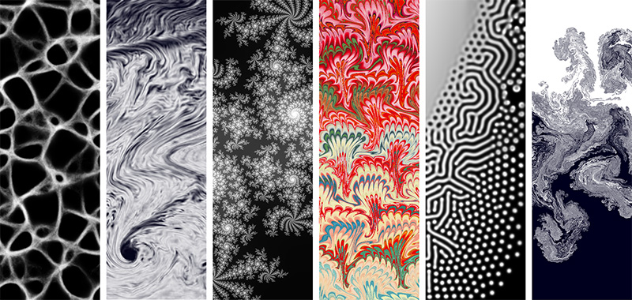

# gpu-io
[](https://apps.amandaghassaei.com/gpu-io/examples/)

[](https://www.npmjs.com/package/gpu-io)
[](https://bundlephobia.com/result?p=gpu-io)
[](https://www.npmtrends.com/gpu-io)
[](https://github.com/amandaghassaei/gpu-io/blob/main/LICENSE.txt)

**A GPU-accelerated computing library for running physics simulations on the web**

gpu-io is a WebGL library that helps you easily compose GPU-accelerated computing workflows.  This library can be used for a variety of applications including real-time physics simulations, particle/agent-based simulations, cellular automata, image processing, and general purpose GPU computations.  gpu-io supports rendering directly to the WebGL canvas and has some built-in features that make interactivity easy.  See [Examples](https://apps.amandaghassaei.com/gpu-io/examples/) for more details.

Designed for WebGL 2.0 (if available), with fallbacks to support WebGL 1.0 - so it should run on practically any mobile or older browsers.  WebGPU support is planned in the future.


### Motivation

The main motivation behind gpu-io is to make it easier to compose GPU-accelerated applications without worrying too much about low-level WebGL details.  This library manages WebGL state, implements shader and program caching, and deals with issues of available WebGL versions or spec inconsistencies across different browsers/hardware.  It should significantly cut down on the amount of boilerplate code and state management you need to do in your applications.  At the same time, gpu-io gives you enough low-level control to write extremely efficient programs for computationally demanding applications.

[As of Feb 2022, WebGL2 has now been rolled out to all major platforms](https://www.khronos.org/blog/webgl-2-achieves-pervasive-support-from-all-major-web-browsers) (including mobile Safari and Microsoft Edge) - but even among WebGL2 implementations, there are differences in behavior across browsers (especially mobile).  Additionally, you may still come across non-WebGL2 enabled browsers in the wild for some time.  gpu-io rigorously checks for these gotchas and uses software polyfills to patch any issues so you don't have to worry about it.  gpu-io will also attempt to automatically [convert your GLSL3 shader code into GLSL1](https://github.com/amandaghassaei/gpu-io/blob/main/docs/GLSL1_Support.md) so that it can run in WebGL1 in a pinch. See [tests/README.md](https://github.com/amandaghassaei/gpu-io/tree/main/tests#browser-support) for more information on browser support.

- [Installation](#installation)
- [Use](#use)
- [Examples](#examples)
- [API](#api)
- [Compatibility with Threejs](#compatibility-with-threejs)
- [Limitations/Notes](#limitationsnotes)
- [Acknowledgements](#acknowledgements)
- [License](#license)
- [Development](#development)


## Installation

### Install via npm

`npm install gpu-io`

And import into your project:

```js
import { GPUComposer, GPULayer, GPUProgram } from 'gpu-io';
```


### Import into HTML

*OR* you can add [gpu-io.js](https://raw.githubusercontent.com/amandaghassaei/gpu-io/main/dist/gpu-io.js) or [gpu-io.min.js](https://raw.githubusercontent.com/amandaghassaei/gpu-io/main/dist/gpu-io.min.js) to your html directly:

```html
<html>
  <head>
    <script src="gpu-io.js"></script>
  </head>
  <body>
  </body>
</html>
```

GPUIO will be accessible globally:

```js
const { GPUComposer, GPULayer, GPUProgram } = GPUIO;
```


## Use

If you have questions about how to use gpu-io: feel free to start a new [discussion thread](https://github.com/amandaghassaei/gpu-io/discussions).

A simple example of how to use gpu-io to simulate 2D diffusion:

```js
import {
  GPUComposer,
  GPULayer,
  GPUProgram,
  renderAmplitudeProgram,
  FLOAT,
  INT,
  REPEAT,
  NEAREST,
} from 'gpu-io';

// Init a canvas element.
const canvas = document.createElement('canvas');
document.body.appendChild(canvas);

// Init a composer.
const composer = new GPUComposer({ canvas });

// Init a layer of float data filled with noise.
const noise = new Float32Array(canvas.width * canvas.height);
noise.forEach((el, i) => noise[i] = Math.random());
const state = new GPULayer(composer, {
  name: 'state',
  dimensions: [canvas.width, canvas.height],
  numComponents: 1, // Scalar state has one component.
  type: FLOAT,
  filter: NEAREST,
  // Use 2 buffers so we can toggle read/write
  // from one to the other.
  numBuffers: 2,
  wrapX: REPEAT,
  wrapY: REPEAT,
  array: noise,
});

// Init a program to diffuse state.
const diffuseProgram = new GPUProgram(composer, {
  name: 'render',
  fragmentShader: `
    in vec2 v_uv;

    uniform sampler2D u_state;
    uniform vec2 u_pxSize;

    out float out_result;

    void main() {
      // Compute the discrete Laplacian.
      // https://en.wikipedia.org/wiki/Discrete_Laplace_operator
      float center = texture(u_state, v_uv).x;
      float n = texture(u_state, v_uv + vec2(0, u_pxSize.y)).x;
      float s = texture(u_state, v_uv - vec2(0, u_pxSize.y)).x;
      float e = texture(u_state, v_uv + vec2(u_pxSize.x, 0)).x;
      float w = texture(u_state, v_uv - vec2(u_pxSize.x, 0)).x;
      const float diffusionRate = 0.1;
      out_result =
        center + diffusionRate * (n + s + e + w - 4.0 * center);
    }
  `,
  uniforms: [
    { // Index of sampler2D uniform to assign to value "u_state".
      name: 'u_state',
      value: 0,
      type: INT,
    },
    { // Calculate the size of a 1 px step in UV coordinates.
      name: 'u_pxSize',
      value: [1 / canvas.width, 1 / canvas.height],
      type: FLOAT,
    },
  ],
});

// Init a program to render state to canvas.
// See https://github.com/amandaghassaei/gpu-io/tree/main/docs#gpuprogram-helper-functions
// for more built-in GPUPrograms to use.
const renderProgram = renderAmplitudeProgram(composer, {
  name: 'render',
  type: state.type,
  components: 'x',
});

// Simulation/render loop.
function loop() {
  window.requestAnimationFrame(loop);

  // Diffuse state and write result to state.
  composer.step({
    program: diffuseProgram,
    input: state,
    output: state,
  });

  // If no "output", will draw to canvas.
  composer.step({
    program: renderProgram,
    input: state,
  });
}
loop(); // Start animation loop.
```

[Demo this code](https://apps.amandaghassaei.com/gpu-io/examples/demo/) - You should see the noise slowly blur, refresh the page to start it over.


## Examples

Check out the [Examples page](https://apps.amandaghassaei.com/gpu-io/examples/) to really understand how gpu-io works and how to easily create touch interactions in your application.
Source code for all examples can be found in the [examples/](https://github.com/amandaghassaei/gpu-io/tree/main/examples) folder.

Please [let me know](https://amandaghassaei.com/about/) if you made something with gpu-io!  Feel free to also post a link in the [Show and Tell](https://github.com/amandaghassaei/gpu-io/discussions/5) discussions thread.  I'll periodically add some of these to the Examples page as well.


## API

Full API documentation can be found in the [docs/](https://github.com/amandaghassaei/gpu-io/tree/main/docs) folder.

More information about writing GLSL shaders for gpu-io can be found at [docs/GLSL](https://github.com/amandaghassaei/gpu-io/blob/main/docs/GLSL.md).


## Compatibility with Threejs

gpu-io can share a webgl context with Threejs so that both libraries will be able to access shared memory on the gpu:

```js
import THREE from 'three';
import {
  GPUComposer,
  GPULayer,
  FLOAT,
  CLAMP_TO_EDGE,
  LINEAR,
} from 'gpu-io';

const renderer = new THREE.WebGLRenderer();
// Use renderer.autoClear = false if you want to overlay threejs stuff
// on top of things rendered to the screen from gpu-io.
// renderer.autoClear = false;

const composer = GPUComposer.initWithThreeRenderer(renderer);
```

Data is passed between gpu-io and Threejs via WebGLTextures.  To bind a GPULayer to a Threejs Texture:

```js
const layer1 = new GPULayer(composer, {
  name: 'layer1',
  dimensions: [100, 100],
  type: FLOAT,
  numComponents: 1,
});

const texture = new THREE.Texture();
// Link webgl texture to threejs object.
layer1.attachToThreeTexture(texture);

// Use texture in threejs scene.
const mesh = new THREE.Mesh(
  new PlaneBufferGeometry(1, 1),
  new MeshBasicMaterial({
    map: texture,
  }),
);

loop() {
  // Undo any changes threejs has made to global WebGL state.
  composer.undoThreeState();

  // Compute things with gpu-io.
  composer.step({
    program: myProgram,
    output: layer1,
  });

  ....

  // Reset global WebGL state back to what threejs is expecting
  // (otherwise we get WebGL errors).
  composer.resetThreeState();
  // Render threejs scene.
  // Updates to layer1 will propagate to texture without any
  // additional needsUpdate flags.
  renderer.render(scene, camera);
}
```

More info about using gpu-io with Threejs can be found in the [Threejs Example](https://github.com/amandaghassaei/gpu-io/tree/main/examples/wave2d).


## Limitations/Notes


### Limitations

- gpu-io currently only supports GPULayers with 1D or 2D arrays of dense data.  3D textures are not officially supported by the library (e.g. there are not currently 3D GPULayers, though I am [looking at adding this](https://github.com/amandaghassaei/gpu-io/issues/8)).  If you want to compute 3D simulations on triangle meshes in gpu-io, you will just need to pass in your 3D position data as a 1D list to a GPULayer and then access it in the fragment shader using .xyz.  TODO: make example for this.
- gpu-io does not currently allow you to pass in your own vertex shaders.  Currently all computation is happening in user-specified fragment shaders; vertex shaders are managed internally.
- In order for the WRAP/FILTER polyfilling to work correctly, any calls to texture() must contain a direct reference to the sampler2D that it should operate on.  For example:

```glsl
varying vec2 v_uv;

uniform sampler2D u_sampler1;
uniform sampler2D u_sampler2;

out vec4 out_result;

vec4 lookupSampler2(vec2 uv) {
  // This is good, it passes u_sampler2 directly to texture().
  return texture(u_sampler2, uv);
}

vec4 lookupSampler(sampler2D sampler, vec2 uv) {
  // At compile time it is hard to say which sampler
  // is passed to texture().
  // This will not be polyfilled, it will throw a warning.
  return texture(sampler, uv);
}

void main() {
  // This is good, it passes u_sampler1 directly to texture().
  vec2 position = texture(u_sampler1, v_uv).xy;

  ....
}
```


### GLSL Version

gpu-io defaults to using WebGL2 (if available) with GLSL version 300 (GLSL3) but you can set it to use WebGL1 or GLSL version 100 (GLSL1) by passing `contextID` or `glslVersion` parameters to `GPUComposer`:

```js
import {
  GPUComposer,
  GLSL1,
  WEBGL1,
} from 'gpu-io';

// Init with WebGL2 (if available) with GLSL1.
const composer1 = new GPUComposer({
  canvas: document.createElement('canvas'),
  glslVersion: GLSL1,
});

// Init with WebGL1 with GLSL1 (GLSL3 is not supported in WebGL1).
const composer2 = new GPUComposer({
  canvas: document.createElement('canvas'),
  contextID: WEBGL1,
});
```

See [docs>GPUComposer>constructor](https://github.com/amandaghassaei/gpu-io/blob/main/docs/classes/GPUComposer.md#constructor) for more information.

gpu-io will automatically convert any GLSL3 shaders to GLSL1 when targeting WebGL1.  If supporting WebGL1/GLSL1 is important to you, see the [GLSL1 Support](https://github.com/amandaghassaei/gpu-io/blob/main/docs/GLSL1_Support.md) doc for more info about what functions/types/operators are available in gpu-io's flavor of GLSL1.


### Transform Feedback

You might notice that gpu-io does not use any transform feedback to handle computations on GPULayers.  Transform feedback is great for things like particle simulations and other types of physics that is computed on the vertex level as opposed to the pixel level.  It is still absolutely possible to perform these types of simulations using gpu-io (see [Examples](https://apps.amandaghassaei.com/gpu-io/examples/)), but currently all the computation happens in a fragment shader.  There are a few reasons for this:

- The main use case for gpu-io is to operate on 2D spatially-distributed state (i.e. fields) stored in textures using fragment shaders.  There is additional support for 1D arrays and lines/particles, but that is secondary functionality.
- Transform feedback is only supported in WebGL2.  At the time I first started writing this in 2020, WebGL2 was not supported by mobile Safari.  Though that has changed recently, for now I'd like to support all functionality in gpu-io in WebGL1/GLSL1 as well.
- The API is simpler if we constrain computations to the fragment shader only.

My current plan is to wait for [WebGPU](https://web.dev/gpu/) to officially launch by default in some browsers, and then re-evaluate some of the design decisions made in gpu-io.  WebGL puts artificial constraints on the current API by forcing general-purpose computing to happen in a vertex and fragment shader rendering pipeline rather than a compute pipeline, so I'd like to get away from WebGL in the long term – and using transform feedback feels like a step backwards at this point.


### Precision

By default all shaders in gpu-io are inited with highp precision floats and ints, but they will fall back to mediump if highp is not available (this is the same convention used by Threejs).  More info in [src/glsl/common/precision.ts](https://github.com/amandaghassaei/gpu-io/blob/main/src/glsl/common/precision.ts).

You can override these defaults by specifying `intPrecision` and `floatPrecision` in GPUComposer's constructor:
```js
import {
  GPUComposer,
  PRECISION_LOW_P,
  PRECISION_MEDIUM_P,
  PRECISION_HIGH_P,
} from 'gpu-io';

const composer = new GPUComposer({
  canvas: document.getElementById('webgl-canvas'),
  intPrecision: PRECISION_MEDIUM_P,
  floatPrecision: PRECISION_MEDIUM_P,
});
```

Of course, you can also always manually specify the precision of a particular variable in your shader code:

```glsl
in vec2 v_uv;

// u_state is a BYTE array, so we can set its precision to lowp.
uniform lowp isampler2D u_state;

out vec4 out_result;

void main() {
  lowp int state = texture(u_state, v_uv).r;
  ....
}
```

**Note: even if highp is specified in your shader code, gpu-io will convert to mediump if the current browser does not support highp (the alternative would be to throw an error).**

I've also included the following helper functions to test the precision of mediump on your device and determine whether highp is supported:

```js
import {
  isHighpSupportedInVertexShader,
  isHighpSupportedInFragmentShader,
  getVertexShaderMediumpPrecision,
  getFragmentShaderMediumpPrecision,
} from 'gpu-io';

// Prints 'highp' or 'mediump' depending on returned precision of
// mediump (16+bit or 32+bit).
// On many devices (esp desktop) mediump defaults to 32bit.
// See https://webglfundamentals.org/webgl/lessons/webgl-precision-issues.html
// for more info.
console.log(getVertexShaderMediumpPrecision());
console.log(getFragmentShaderMediumpPrecision());

// Print true or false depending on highp support of browser/device.
console.log(isHighpSupportedInVertexShader());
console.log(isHighpSupportedInFragmentShader());
```


## Acknowledgements

I used a few codebases as reference when writing this, thanks to their authors for making these repos available:

- [three.js](https://github.com/mrdoob/three.js/)
- [regl](https://github.com/regl-project/regl)
- [gpu.js](https://github.com/gpujs/gpu.js/)
- [WebGL Boilerplate](https://webglfundamentals.org/webgl/lessons/webgl-boilerplate.html)
- [GPU Accelerated Particles with WebGL 2](https://gpfault.net/posts/webgl2-particles.txt.html)

Other resources:

- [WebGL best practices](https://developer.mozilla.org/en-US/docs/Web/API/WebGL_API/WebGL_best_practices) by Mozilla
- [Compatibility issues in Shadertoy / webGLSL](https://shadertoyunofficial.wordpress.com/2016/07/22/compatibility-issues-in-shadertoy-webglsl/) Shadertoy – Unofficial


## License

This work is distributed under an [MIT license](https://github.com/amandaghassaei/gpu-io/blob/main/LICENSE.txt).  Note that gpu-io depends on a few npm packages:

- [@amandaghassaei/type-checks](https://www.npmjs.com/package/@amandaghassaei/type-checks) - MIT license, no dependencies.
- [@petamoriken/float16](https://www.npmjs.com/package/@petamoriken/float16) - MIT license, no dependencies.
- [changedpi](https://www.npmjs.com/package/changedpi) - MIT license, no dependencies.
- [file-saver](https://www.npmjs.com/package/file-saver) - MIT license, no dependencies.


## Development

Update 10/2022:  I'm switching gears a bit to focus on some new projects, but I'll be continuing to use gpu-io as the foundation for almost everything I'm working on.  I expect that some new features will be added to this over the next six months or so, but I can't guarantee I'll have time to help debug issues you may run into.  Feel free to log [issues](https://github.com/amandaghassaei/gpu-io/issues) or ask [questions](https://github.com/amandaghassaei/gpu-io/discussions), but don't expect a super prompt response! See the [Examples](https://apps.amandaghassaei.com/gpu-io/examples/) for more info about how to use this library.

Pull requests welcome! I hope this library is useful to others, but I also realize that I have some very specific needs that have influenced the direction of this code – so we'll see what happens.  Please [let me know](https://amandaghassaei.com/about/) if you end up using this, I'd love to see what you're making!  


### Compiling with Webpack

Compiled with [webpack](https://www.npmjs.com/package/webpack).  To build ts files from `src` to js in `dist` run:

```
npm install
npm run build
```


### Automated Testing

I'm using mocha + karma + chai + headless Chrome to test the components of gpu-io, following the setup described in [Automated testing with Headless Chrome](https://developer.chrome.com/blog/headless-karma-mocha-chai/).  Those tests are located in [tests/mocha/](https://github.com/amandaghassaei/gpu-io/blob/main/tests/mocha/).  To run the automated tests, use:

```
npm run test
```

The automated tests do not get full code coverage yet, but I'm planning to add to them when I go back to implement WebGPU features in this library.

### Browser/Device Testing

I've also included a webpage for testing various functions of this library in a browser/hardware combo of your choice.  This page is current hosted at [apps.amandaghassaei.com/gpu-io/tests/](https://apps.amandaghassaei.com/gpu-io/tests/).

Note: The detected OS and browser version may not always be 100% accurate.

See [tests/README#browser-support](https://github.com/amandaghassaei/gpu-io/blob/main/tests/README.md#browser-support) for results of various browser/hardware combos.
