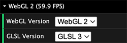

# GLSL1 Support

OpenGL Shading Language (GLSL) is the language used for writing vertex and fragment shader code in WebGL.  WebGL2 supports a newer version of GLSL called GLSL3, while WebGL1 only supports GLSL1.  GLSL3 provides new types, operators, and functions that were not previously supported by GLSL1 and has a slightly different syntax for importing/exporting data from shader programs.

More info about the difference between GLSL and WebGL versions:

- [GLSL Versions](https://github.com/mattdesl/lwjgl-basics/wiki/GLSL-Versions) by Matt DesLauriers
- [WebGL1 Reference Card](https://www.khronos.org/files/webgl/webgl-reference-card-1_0.pdf) by Khronos
- [WebGL2 Reference Card](https://www.khronos.org/files/webgl20-reference-guide.pdf) by Khronos
- [WebGL2 from WebGL1](https://webgl2fundamentals.org/webgl/lessons/webgl1-to-webgl2.html) by [webgl2fundamentals.org](https://webgl2fundamentals.org/)
- [WebGL Report](https://webglreport.com/?v=2) by Cesium

When necessary, gpu-io will attempt to automatically convert GLSL3 shaders to GLSL1 so that they can be run in browsers that only support WebGL1.  This simplifies the process of developing an application by removing the burden of managing multiple sets of shaders targeting different GLSL versions.  All of the [Examples](https://apps.amandaghassaei.com/gpu-io/examples/) in this repository run in both WebGL2 and WebGL1; you can test this for yourself using the WebGL controls menu in each example application:



When running in a WebGL1-only browser, gpu-io preprocesses your GLSL3 shader code to convert it into GLSL1.  Additionally, gpu-io provides several polyfills to extend the built-in functionality of GLSL1 to more closely match GLSL3, giving you more functionality than bare-bones GLSL1.  This page gives detailed info about the GLSL3 functionality that has been added to GLSL1 by gpu-io and a list of functions/types/operators that are not currently supported (and should be avoided if you want your application to support WebGL1).

In general, I recommend writing your application for WebGL2 with GLSL3 shaders and allowing gpu-io to convert your GLSL3 to GLSL1 when needed, rather than running GLSL1 shaders in WebGL2.  To test out how your application performs in WebGL1, initialize your GPUComposer to force it to target WebGL1:

```js
import { WEBGL1, GPUComposer } from 'gpu-io';
// Init with WebGL1 with GLSL1 (GLSL3 is not supported in WebGL1).
const composer = new GPUComposer({
  canvas: document.createElement('canvas'),
  contextID: WEBGL1,
});
```

In 2022 WebGL2 was finally rolled out to all major platforms (including iOS, the last holdout), so the need to convert shaders to GLSL1 will eventually disappear, but for now this functionality will help to support many devices that are not receiving regular updates. (This project was started long before widespread WebGL2 support.)


## Overview of GLSL3 to GLSL1 Conversion

- All unsigned integer types (`uint`, `uvec2`, `uvec3`, `uvec4`, `usampler2D`) are automatically converted to signed integer types (`int`, `ivec2`, `ivec3`, `ivec4`, `isampler2D`) when targeting GLSL1.
- The only texture lookup function officially supported by gpu-io is `[i|u]vec4 texture([i|u]sampler2D, vec2 uv)`.  Currently, the bias parameter is not supported.  Other built-in GLSL1 texture lookup functions may also work, but have not been tested.
- `out float|int|[u|i]vec(2|3|4)` declarations are automatically converted to `gl_FragColor` when targeting GLSL1; these variables will be typecast and padded with extra zeros if needed to convert them to a `vec4` type.  Additionally, gpu-io interprets the `layout` and `location` declarations for shader programs with multiple outputs so that they will work as expected in GLSL1 using a WebGL1-compatible fallback.  You can test this by running the [Physarum Example](https://apps.amandaghassaei.com/gpu-io/examples/physarum/) in GLSL1, which uses multiple outputs in one of its simulation steps.

More information about the implementation can be found in [regex.ts](../src/regex.ts) and [polyfills.ts](../src/polyfills.ts).  Pull requests welcome, I'm sure there are ways to speed some of these functions up.  The GLSL1 [bitwise logical operators](#operators) are particularly in need of help, as they include branching conditional statements.

Type annotations used in function descriptions:

`T` = `float` | `vec2` | `vec3` | `vec4`  
`TI` = `int` | `ivec2` | `ivec3` | `ivec4`  
`TU` = `uint` | `uvec2` | `uvec3` | `uvec4`  

(Note that any unsigned integer types will be cast as signed integer types within the GLSL1 fragment shader, as there are no unsigned integer types in GLSL1)


## Types

The following type substitutions are made automatically when targeting GLSL1:

- `uint` is converted to `int`
- `uvec#` is converted to `ivec#` ( `#` = `2` | `3` | `4` )
- `isampler2D` and `usampler2D` are converted to `sampler2D`


## Operators

Because operator overloading does not seem to be supported through GLSL1, I've created operator functions that will work in both GLSL3 and GLSL1.

- `%` replaced by:
	- `T|TI|TU mod(T|TI|TU x, T|TI|TU y)`
	- `T|TI|TU mod(T|TI|TU x, float|int|uint y)`
- `<<` replaced by:
	- `TI|TU bitshiftLeft(TI|TU x, T1|TU shift)`
	- `TI|TU bitshiftLeft(TI|TU x, int|uint shift)`
- `>>` replaced by:
	- `TI|TU bitshiftRight(TI|TU x, TI|TU shift)`
	- `TI|TU bitshiftRight(TI|TU x, int|uint shift)`
- `&` replaced by:
	- `int|uint bitwiseAnd8(int|uint x, int|uint y)` for up to 8 bit AND
	- `int|uint bitwiseAnd16(int|uint x, int|uint y)` for up to 16 bit AND
	- `int|uint bitwiseAnd(int|uint x, int|uint y)` for up to 32 bit AND
- `^` replaced by:
	- `int|uint bitwiseXOR8(int|uint x, int|uint y)` for up to 8 bit XOR
	- `int|uint bitwiseXOR16(int|uint x, int|uint y)` for up to 16 bit XOR
	- `int|uint bitwiseXOR(int|uint x, int|uint y)` for up to 32 bit XOR
- `|` replaced by:
	- `int|uint bitwiseOr8(int|uint x, int|uint y)` for up to 8 bit OR
	- `int|uint bitwiseOr16(int|uint x, int|uint y)` for up to 16 bit OR
	- `int|uint bitwiseOr(int|uint x, int|uint y)` for up to 32 bit OR
- `~` replaced by:
	- `int|uint bitwiseNot8(int|uint x)` for up to 8 bit NOT
	- `int|uint bitwiseNot16(int|uint x)` for up to 16 bit NOT
	- `int|uint bitwiseNot(int|uint x)` for up to 32 bit NOT


## Built-In Functions

gpu-io contains GLSL1 polyfills for many GLSL3 built-in functions (pages 7-8 in the [WebGL2 Reference Card](https://www.khronos.org/files/webgl20-reference-guide.pdf)).  Along with the built-in functions described the in the WebGL1/GLSL1 spec (page 4 in the [WebGL1 Reference Card](https://www.khronos.org/files/webgl/webgl-reference-card-1_0.pdf)), the following functions are available to GLSL1 fragment shader programs:

### Common Functions

- `TI abs(TI x)`
- `TI sign(TI x)`
- `T trunc(T x)`
- `T round(T x)`
- `T roundEven(T x)`
- `TI|TU min(TI|TU x, TI|TU y)`
- `TI|TU min(TI|TU x, int|uint y)`
- `TI|TU clamp(TI|TU x, TI|TU min, TI|TU max)`
- `TI|TU clamp(TI|TU x, int|uint min, int|uint max)`
- `TI|TU mix(TI|TU x, TI|TU y, TI|TU a)`
- `TI|TU mix(TI|TU x, TI|TU y, int|uint a)`

### Hyperbolic Trigonometric Functions

- `float sinh(float x)`
- `float cosh(float x)`
- `float tanh(float x)`
- `float asinh(float x)`
- `float acosh(float x)`
- `float atanh(float x)`

### Matrix Functions

- `mat2|mat3|mat4 outerProduct(vec2|vec3|vec4 x, vec2|vec3|vec4 y)`
- `mat2|mat3|mat4 transpose(mat2|mat3|mat4 x)`
- `float determinant(mat2|mat3|mat4 x)`


### Texture Lookup Functions

- `[i|u]vec4 texture([i|u]sampler2D, vec2 uv)` (no bias parameter)

Currently gpu-io replaces all instances of `texture` with a custom function that ensures the correct filtering and wrap settings are applied to the sampler2D (polyfilling with a fragment shader implementation when necessary, this is needed for both WebGL1 and WebGL2).  For int and uint sampler2D types (which are not natively supported by GLSL1), gpu-io will additionally cast the value of `texture(sampler, uv)` to an `ivec4` so that the following shader code will work in GLSL1:

```glsl
varying vec2 v_uv;
uniform isampler2D u_intSampler;
uniform usampler2D u_uintSampler;

....

void main() {
  ivec4 intValue1 = texture(u_intSampler, v_uv);
  int intValue2 = texture(u_intSampler, v_uv).x;
  uvec4 uintValue1 = texture(u_uintSampler, v_uv);
  uvec2 uintValue2 = texture(u_uintSampler, v_uv).xy;
  ....
}
```

### Derivative Functions

gpu-io automatically enables [OES_standard_derivatives](https://developer.mozilla.org/en-US/docs/Web/API/OES_standard_derivatives) extension when the following functions are detected in a GPUProgram's source:

- `dFdx`
- `dFdy`
- `fwidth`

Additionally, gpu-io adds the following line to the shader source to enable the extension:

`#extension GL_OES_standard_derivatives : enable`

Note: derivative functions are not available for WebGL 2 with GLSL1, please use GLSL3 instead.


# Unsupported GLSL3 Features

The following GLSL3 types and methods are NOT currently polyfilled by gpu-io, and therefore are not accessible to GLSL1 shaders.  Using these types and methods in your shader code may throw an error in some browsers (typically mobile) that only support WebGL1.


## Unsupported Types

The following types are currently NOT supported in GLSL1:

- `matNxM` (only `mat2`, `mat3`, `mat4` are allowed)
- `[i|u]sampler3D`
- `isamplerCube` and `usamplerCube`
- `samplerCubeShadow`
- `sampler2DShadow`
- `[i|u]sampler2DArray`
- `sampler2DArrayShadow`


## Unsupported Operators

The following assignment operators are NOT currently supported in GLSL1.  See [Operators](#operators) for info about how to get around this using operator polyfill functions.

- `%=`
- `<<=`
- `>>=`
- `&=`
- `^=`
- `|=`


## Unsupported GLSL3 Built-In Functions

The following GLSL3 functions are currently NOT available to GLSL1 fragment shaders:

### Value Checks

- `isnan`
- `isinf`

### Float/Int Bit Conversions

- `floatBitsToInt`
- `floatBitsToUint`
- `intBitsToFloat`
- `uintBitsToFloat`

### Matrix Functions

- `inverse`

### Texture Lookup Functions

- All texture lookup functions other than `[i|u]vec4 texture([i|u]sampler2D, vec2 uv)` are not officially supported by this library.  Most of them probably still work, but none of have been tested.  See the [WebGL1 Reference Card](https://www.khronos.org/files/webgl/webgl-reference-card-1_0.pdf) to find out what is supported in GLSL1.


## Other GLSL1 Gotchas

- GLSL1 uniforms cannot be used to set the length of a for loop.

The following code will run in GLSL3, but not in GLSL1:

```js
// JavaScript
const program = new GPUProgram({
  name: 'example', composer, fragmentShader, uniforms: [{ name: 'u_numIters', type: INT, value: 7 }],
});
....

program.setUniform('u_numIters', 3);
```

```glsl
// fragmentShader
uniform int u_numIters;
....

void main() {
  for (int i = 0; i < u_numIters; i++) {
    // Do something in loop.
  }
  ....
}
```

Instead, use uniform as a breaking condition:

```glsl
// fragmentShader
uniform int u_numIters;
....

void main() {
  for (int i = 0; i < 10; i++) {
    if (i == u_numIters) break;
    // Do something in loop.
  }
  ....
}
```

OR use compile-time constants (see the [Julia Set Fractal](https://apps.amandaghassaei.com/gpu-io/examples/fractal/) for an example of this.):

```js
// JavaScript
const program = new GPUProgram({
  name: 'example', composer, fragmentShader, compileTimeConstants: { NUM_ITERS: '7' },
});
....

program.recompile({ NUM_ITERS: '3' });
```

```glsl
// fragmentShader
....

void main() {
  for (int i = 0; i < NUM_ITERS; i++) {
    // Do something in loop.
  }
  ....
}
```

