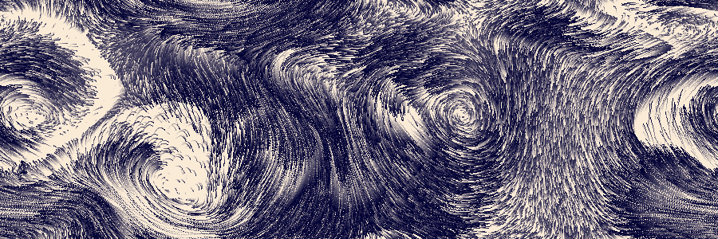

# gpu-io Examples

[gpu-io](https://github.com/amandaghassaei/gpu-io) is a GPU-accelerated computing library for physics simulations and other mathematical calculations.  This page contains a series of interactive examples applications that demonstrate key capabilities of the library.

gpu-io source code: [github.com/amandaghassaei/gpu-io](https://github.com/amandaghassaei/gpu-io)  
examples source code: [github.com/amandaghassaei/gpu-io/examples](https://github.com/amandaghassaei/gpu-io/tree/main/examples)  

## Grid-Based Simulations

### [Reaction Diffusion](https://apps.amandaghassaei.com/gpu-io/examples/reaction-diffusion/)
  
This app simulates a simple <a href="https://en.wikipedia.org/wiki/Reaction%E2%80%93diffusion_system">reaction-diffusion system</a>, where two virtual chemicals interact to create dynamic patterns.  Similar systems were proposed by <a href="https://www.dna.caltech.edu/courses/cs191/paperscs191/turing.pdf">Alan Turing in 1952</a> as a mechanism for pattern formation in plants and animals.  This reaction-diffusion system is particularly sensitive to two parameters: K (varies along x-axis) and F (varies along y-axis).  You can interactively explore regions of K,F parameter space by zooming and panning across the screen.

## Particle + Grid Simulations

### [Physarum Transport Network](https://apps.amandaghassaei.com/gpu-io/examples/physarum/)
  
This app simulates the network effects of a multicellular slime mold (Physarum polycephalum), based on a 2010 paper by Jeff Jones: <a href="https://uwe-repository.worktribe.com/output/980579">"Characteristics of pattern formation and evolution in approximations of Physarum transport networks"</a> and work by <a href="https://cargocollective.com/sagejenson/physarum">Sage Jenson</a>.  In this simulation, simple particle "agents" interact with an underlying field of chemical attractants to form complex, emergent behaviors.

### [Fluid Simulation](https://apps.amandaghassaei.com/gpu-io/examples/fluid/)
  
This simulation solves the <a href="https://en.wikipedia.org/wiki/Navier%E2%80%93Stokes_equations">Navier-Stokes equations</a> for incompressible fluids. The fluid visualization includes thousands of <a href="https://en.wikipedia.org/wiki/Lagrangian_particle_tracking">Lagrangian particles</a> that follow the velocity field and leave behind semi-transparent trails as they move.

## ThreeJS

### [2D Wave Equation](https://apps.amandaghassaei.com/gpu-io/examples/wave2d/)
  
This app simulates the [2D wave equation](https://en.wikipedia.org/wiki/Wave_equation) and renders the resulting height field as a 3D mesh  Additionally, it simulates realtime [caustics](https://en.wikipedia.org/wiki/Caustic_(optics)) formed by light shining through the 3D surface and renders the result as a texture ([method described in more detail by Evan Wallace](https://medium.com/@evanwallace/rendering-realtime-caustics-in-webgl-2a99a29a0b2c)).  All computations are performed in gpu-io and the results are passed to [Threejs](https://threejs.org/) without ever leaving the GPU.

## Simple Examples

### [Conway's Game of Life](https://apps.amandaghassaei.com/gpu-io/examples/gol/)
  
The 1-bit cellular automaton <a href="https://en.wikipedia.org/wiki/Conway%27s_Game_of_Life">Conway's Game of Life</a>.

### [Julia Set Fractal](https://apps.amandaghassaei.com/gpu-io/examples/fractal/)
  
This app renders 2D <a href="https://en.wikipedia.org/wiki/Julia_set">Julia set</a> fractals for a variety of input parameters.